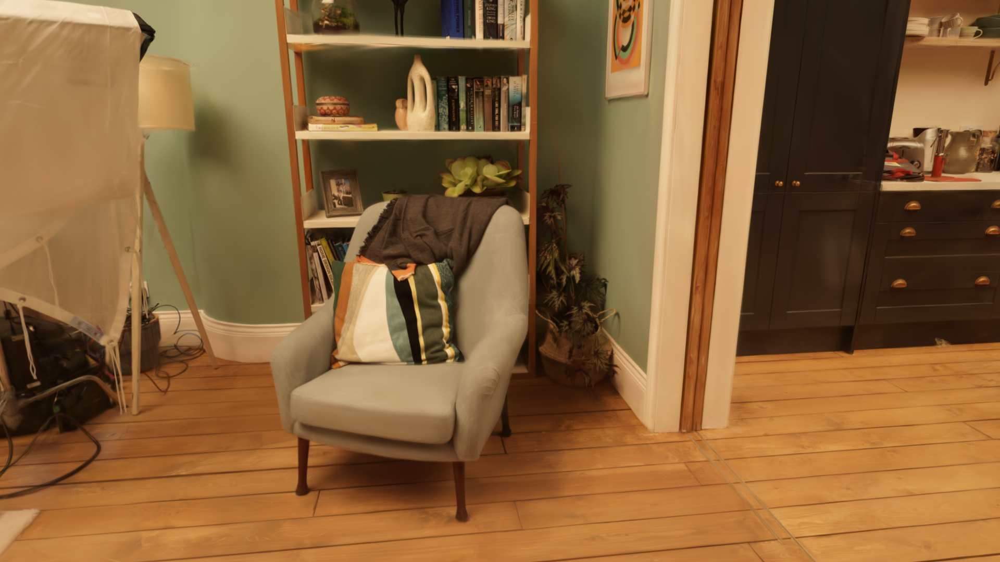
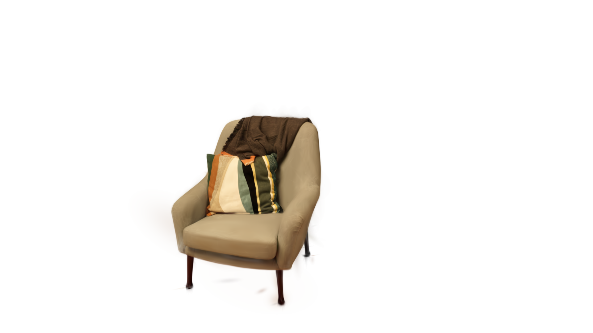
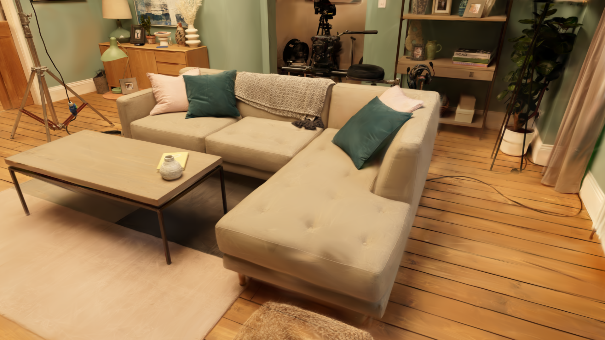
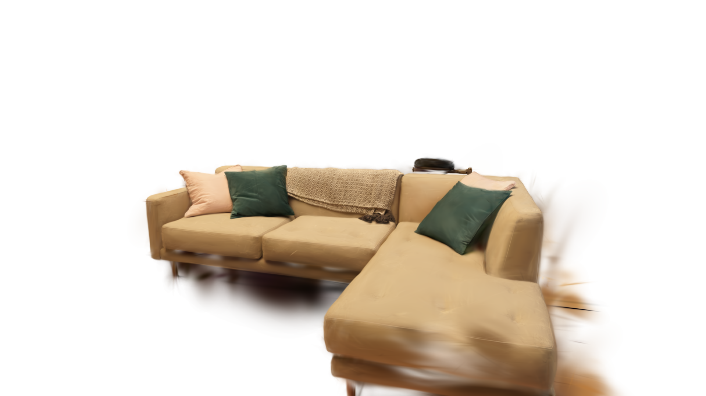
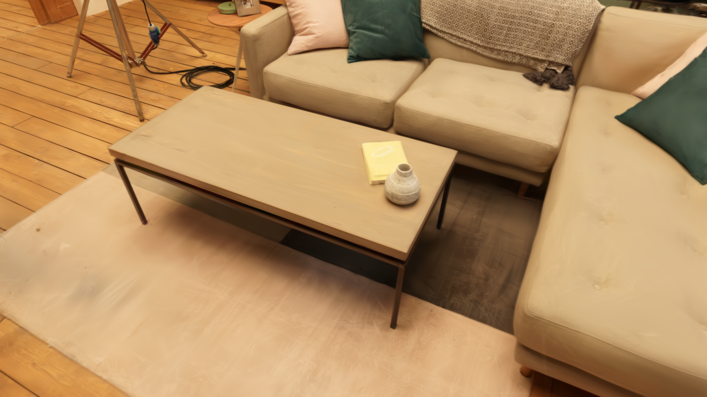
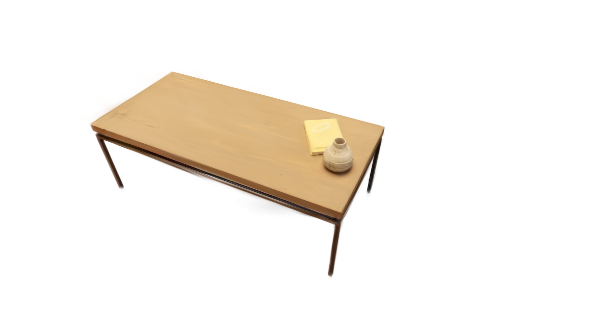
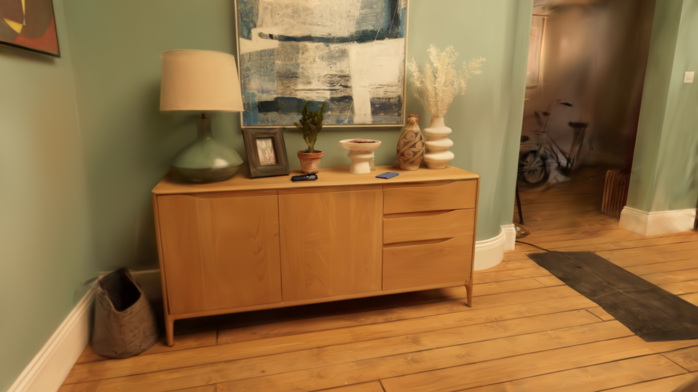
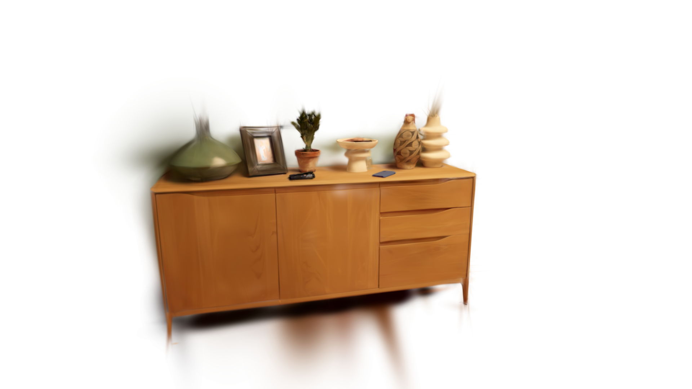

# Room pipeline — Gaussian splat scene segmentation

Decomposes a Gaussian splat scan of a room (`.ply`) into a labeled set of
individual furniture / decor objects (`.splat` puzzle pieces) plus the
architectural shell (walls / floor / ceiling). Drives a web viewer where
you can toggle items on/off.

Built on top of Qwen 3.6 35B-A3B-AWQ (served by vLLM) for visual
reasoning (room-type detection, multi-pass object inventory, bbox
proposal, QC) and SAM3 for image-space segmentation lifted back to 3D
via multi-view voting.

## Result

Input: a single ~3 M-splat `.ply` of a room scan.

Output: per-object `.splat` files (couch, armchair, stool, kitchen
island, paintings, etc.) + `_background.splat` (walls / floor / ceiling).
The full set reassembles into the original scan.

### Object isolation

Each pair below is rendered from the **same camera** — left is the
original scan, right is a single isolated `.splat` extracted by the
pipeline. Matched cameras mean a website can wipe-cross-dissolve
between them.

| Object | In context | Isolated |
|---|---|---|
| Armchair |  |  |
| Sectional sofa |  |  |
| Coffee table |  |  |
| Sideboard |  |  |

Camera specs in [`docs/showcase/wipe/cameras.json`](docs/showcase/wipe/cameras.json).

## How it works

1. **Foundation alignment** — rotate scan so floor is y-down and walls
   are world-axis-aligned. Hough-line on the rendered topdown closes
   the last 5-10° that PCA misses.
2. **Inventory (Qwen)** — multi-pass disjoint-category prompts on the
   topdown + 4 cross-cut quadrant dioramas. Returns labeled pixel
   bboxes.
3. **Per-object extraction** — for each bbox: back-project to a
   visual-hull seed → 4-view SAM3 wide carve → floor-drop with
   Qwen-judged threshold sweep → 4-view SAM3 tight refine → optional
   bbox-sweep fallback if the tight carve fails QC. Specialty
   procedures for thin items (TV pitch-sweep, wall art 8-yaw + 8-pitch
   vote).
4. **Companions** — after parent extracts (TV / bookshelf / sideboard),
   re-prompt Qwen for small items sitting on them (soundbar, remote,
   books, vases).
5. **Background subtract + reassemble** — KDTree-match each object PLY
   against the rotated full scan, drop matched splats, ship the
   surviving splats as the background. Reassemble for visual QC.

Driver: `pipeline/run_all.py`. Per-stage scripts run independently
too (`extract_one.py`, `sam_carve.py`, `floor_drop.py`, `sam_tight.py`,
etc.). See `pipeline/PIPELINE_ORDER.md` for the authoritative
ordering.

## Requirements

- Linux, Docker 24+ with `nvidia-container-toolkit`
- One NVIDIA GPU, **≥ 48 GB VRAM** (L40S / A6000-48GB / A40 /
  RTX 6000 Ada)
- Qwen 3.6 35B-A3B-AWQ weights (~25 GB) downloaded to a local path.

  Model used: **[Qwen/Qwen3-VL-30B-A3B-Instruct-AWQ](https://huggingface.co/Qwen/Qwen3-VL-30B-A3B-Instruct-AWQ)**
  — AWQ-quantized vision-language model from the Qwen team, used for
  inventory pass labelling, per-view bbox proposals, and QC.

  Quantized for ~48 GB-VRAM single-GPU fit. The pipeline isn't limited
  to this specific build — any Qwen-VL-compatible model that vLLM can
  serve (full-precision, GPTQ, other AWQ variants, larger/smaller
  sizes) will work as long as the chat API is the same. Point
  `QWEN_WEIGHTS_HOST_PATH` at the alternative weights directory and
  the pipeline scripts (which talk to vLLM via OpenAI-compatible HTTP)
  pick it up transparently. Full-precision needs more VRAM; smaller
  models trade some labelling accuracy.

  ```bash
  pip install huggingface_hub
  huggingface-cli login   # one-time; needs an HF token with model access
  huggingface-cli download Qwen/Qwen3-VL-30B-A3B-Instruct-AWQ \
      --local-dir ~/models/Qwen3.6-35B-A3B-AWQ
  ```

  SAM model used: **[facebook/sam3](https://huggingface.co/facebook/sam3)**
  (text-prompted segmentation). Auto-downloads on first use via
  `transformers` if the container has network access. To pre-cache:

  ```bash
  huggingface-cli download facebook/sam3
  ```

## Quickstart

```bash
git clone <this-repo>
cd room_pipeline_v002

# Build the image (vLLM base + pipeline scripts). ~10 GB compressed,
# ~33 GB on disk. One-time, ~15-25 min depending on network.
docker build -t splat-pipeline -f docker/Dockerfile .

# Configure paths for your host. Edit docker/.env with:
#   QWEN_WEIGHTS_HOST_PATH=/abs/path/to/Qwen3.6-35B-A3B-AWQ
#   SCENE_HOST_PATH=/abs/path/to/your/scene_dir
cp docker/.env.example docker/.env
$EDITOR docker/.env

# Run the full pipeline on a scene. The container starts vLLM in the
# background and waits for it to load before kicking off run_all.py.
docker compose -f docker/docker-compose.yml run --rm pipeline \
    python /workspace/pipeline/run_all.py /workspace/scene --step 1

docker compose -f docker/docker-compose.yml run --rm pipeline \
    python /workspace/pipeline/run_all.py /workspace/scene --step 2

docker compose -f docker/docker-compose.yml run --rm pipeline \
    python /workspace/pipeline/run_all.py /workspace/scene --step 3

# Package the puzzle pieces.
docker compose -f docker/docker-compose.yml run --rm pipeline bash -c "
    python /workspace/pipeline/extract_background.py /workspace/scene &&
    python /workspace/pipeline/extract_final_outputs.py /workspace/scene &&
    python /workspace/pipeline/merge_scene.py /workspace/scene"
```

The scene directory after a run contains:

```
<scene>/
├── step7_cardinal_aligned.ply       # axis-aligned source
├── 02_<slug>/                       # one per detected object
│   ├── 1_visual_hull.ply
│   ├── 2_sam_wide.ply
│   ├── 3_floor_drop.ply
│   ├── 4_sam_tight.ply
│   ├── 5_sweep_fallback.ply         # or 5_subtracted.ply
│   └── renders/<stage>/{y0,y90,y180,y270,topdown}.png
├── scene_background.ply
├── scene_reassembled.ply
└── final_outputs/
    ├── <slug>.splat                 # one per object
    └── _background.splat
```

## Layout

```
docker/        — Dockerfile + compose + entrypoint
pipeline/   — pipeline scripts, single-file modules
                 (run_all.py is the orchestrator)
```

`pipeline/PIPELINE_ORDER.md` is the source of truth for stage order.
`pipeline/OUTPUT_STRUCTURE.md` describes the per-object directory
contract.

## Scaling to multiple GPUs / scenes in parallel

The pipeline is scale-ready out of the box — every script reads its
backend URLs from env vars, defaulting to localhost when unset:

| Env var | Default | What it controls |
|---|---|---|
| `QWEN_URL` | `http://127.0.0.1:8000/v1` | vLLM endpoint |
| `QWEN_MODEL` | `qwen36-awq` | served model name |
| `SAM_URL` | `http://127.0.0.1:8001` | persistent SAM3 server |

**To run N scenes in parallel on N GPUs:**

```bash
# Start N container instances, each pinned to a different GPU + port
for i in 0 1 2; do
  sudo docker run -d --name splat-pipe-$i \
      --gpus device=$i \
      -e QWEN_PORT=$((8000 + i)) \
      -e SAM_SERVER_PORT=$((9000 + i)) \
      -v /path/to/scene_$i:/workspace/scene \
      -v /path/to/Qwen:/models/qwen36-awq:ro \
      -p $((8000 + i)):$((8000 + i)) \
      -p $((9000 + i)):$((9000 + i)) \
      splat-pipeline:latest \
      sleep infinity
done

# Then point each pipeline at its container's URL:
QWEN_URL=http://127.0.0.1:8000/v1 SAM_URL=http://127.0.0.1:9000 \
    ./run_pipeline.sh scene_0 &
QWEN_URL=http://127.0.0.1:8001/v1 SAM_URL=http://127.0.0.1:9001 \
    ./run_pipeline.sh scene_1 &
QWEN_URL=http://127.0.0.1:8002/v1 SAM_URL=http://127.0.0.1:9002 \
    ./run_pipeline.sh scene_2 &
wait
```

3 scenes finish in the time one takes (~2h 44min on a 48 GB GPU).

**Within-scene parallelism** (multiple object extractions hitting one
vLLM concurrently) is *not* enabled yet — `procedure_dispatch.py` runs
objects serially. vLLM's continuous batching would absorb concurrent
requests cleanly; the change is to swap `subprocess.run` for
`asyncio.create_subprocess_exec` with a semaphore.

## License

MIT.
